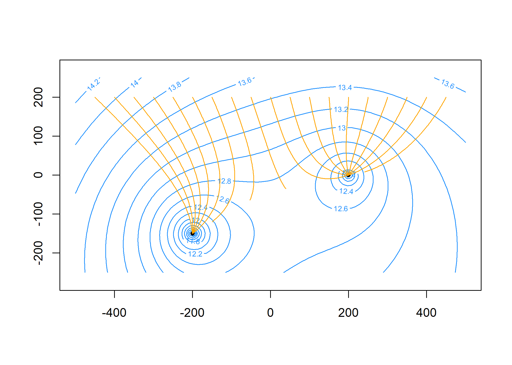

<!-- README.md is generated from README.Rmd. Please edit that file -->

# raem

<!-- badges: start -->
<!-- badges: end -->

`raem` is an R package for modeling steady-state single-layer
groundwater flow using analytic elements.

## Installation

You can install the development version of raem from
[GitHub](https://github.com/) with:

``` r
# install.packages("devtools")
devtools::install_github("cneyens/raem")
```

## Example

Construct an analytic element model with uniform background flow, two
extraction wells and a reference point.

Specify the aquifer parameters and create elements:

``` r
library(raem)

k = 10
top = 10
base = 0
n = 0.2
TR = k * (top - base) # transmissivity

uf = uniformflow(TR, gradient = 0.001, angle = -45)
rf = constant(xc = -1000, yc = 0, hc = 10)
w1 = well(xw = 200, yw = 0, Q = 250)
w2 = well(xw = -200, yw = -150, Q = 400)
```

Create the model. This automatically solves the system of equations.

``` r
m = aem(k = k, top = top, base = base, n = n, 
        uf, rf, w1, w2)
```

Find the head and discharge at two locations `x = 50, y = 200` and
`x = 100, y = 200`. Note that there are no vertical flow components in
this model:

``` r
heads(m, x = c(50, 100), y = 200)
#> [1] 8.368770 8.333135

discharge(m, c(50, 100), 200, z = top) # [L^2 / T]
#>              Qx         Qy Qz
#> [1,] 0.08017395 -0.3184762  0
#> [2,] 0.06041242 -0.3347206  0
```

Plot head contours and element locations. First, specify the contouring
grid:

``` r
xg = seq(-500, 500, length = 100)
yg = seq(-250, 250, length = 100)
```

Now plot:

``` r
contour(m, xg, yg, z = 'heads', col = 'dodgerblue3', nlevels = 20)
plot(m, add = TRUE)
```


Compute particle traces starting along `y = 200` at 20 intervals per
year for 5 years and add to plot:

``` r
paths = tracelines(m, x0 = seq(-450, 450, 50), y0 = 200, z0 = top, times = seq(0, 5*365, 365/20))
plot(paths, add = TRUE, col = 'orange3')
```


